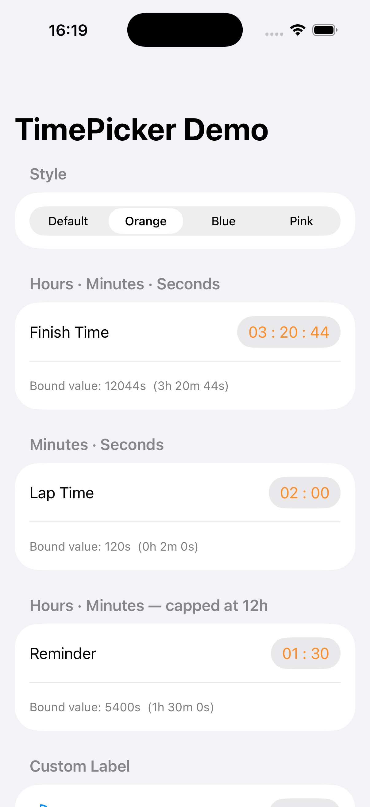
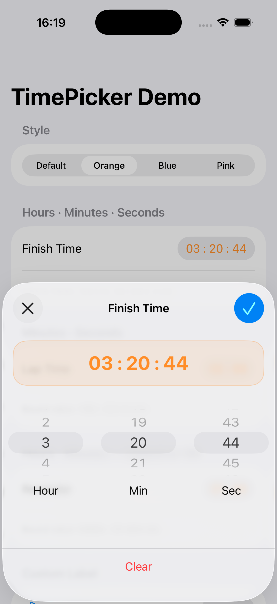
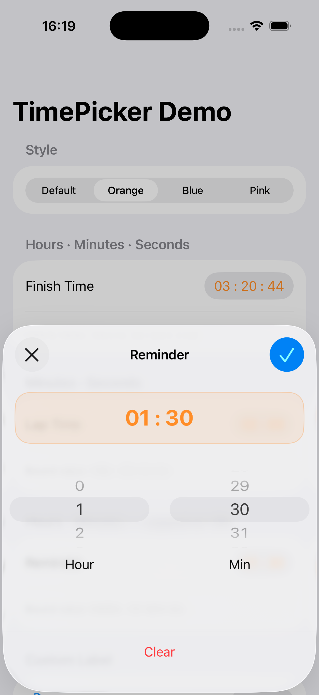

# TimePicker

     

A SwiftUI control for picking a duration — hours, minutes, and seconds — from a wheel-based sheet, bound directly to a `TimeInterval?`.


## 📝 Overview

1. A reusable SwiftUI control for picking a duration from a wheel-based sheet, distributed via Swift Package Manager.
2. Binds directly to a `TimeInterval?`; a `nil` value renders as a placeholder (`-- : -- : --`).
3. Shows any subset of hours/minutes/seconds through `TimePickerComponents`, with the hours range capped by `maximumHours`.
4. Themeable across a whole subtree via `TimePickerStyle` and the `.timePickerStyle(_:)` environment modifier.
5. Ships a public `DurationFormatter` to render or parse the same value elsewhere, and localizes its UI through a string catalog.
6. Built with pure SwiftUI and no third-party dependencies.


## ✨ Features

1. **Configurable units** — show any subset of hours/minutes/seconds via `TimePickerComponents`, using a preset or a custom set.
2. **Bounded hours** — cap the hours wheel with `maximumHours`.
3. **Themeable** — style every picker in a subtree with `TimePickerStyle`, or override individual properties inline with the `.timePickerStyle(...)` modifier.
4. **Custom label** — use the default text title or supply your own `@ViewBuilder` label.
5. **Reusable formatting** — render or parse a `TimeInterval` anywhere with the public `DurationFormatter`; overflow folds into the leading unit.
6. **Placeholder support** — an empty value renders as `-- : -- : --` instead of zeros.
7. **Localized** — UI strings ship in a string catalog.


## 🛠️ Technologies & Frameworks

- iOS 26
- Swift 6
- SwiftUI
- Swift Package Manager - distribution


## 🔧 Development Tools

- Xcode 26.5
- Version control: GitHub / Git
- AI tools: [Claude Code](https://claude.com/claude-code)


## 📦 Installation

### Local Swift Package

Clone or copy this repository next to your app, then add it as a local package.

In Xcode: **File → Add Package Dependencies… → Add Local…** and select the `TimePicker` folder.

Or reference it by path in your `Package.swift`:

```swift
dependencies: [
    .package(path: "../TimePicker")
]
```

Then add the product to your target:

```swift
.target(
    name: "YourApp",
    dependencies: ["TimePicker"]
)
```


## 💻 Usage

### Basic

Bind the picker to an optional `TimeInterval`. A `nil` value renders as a placeholder (`-- : -- : --`).

```swift
import SwiftUI
import TimePicker

struct ContentView: View {
    @State private var duration: TimeInterval?

    var body: some View {
        Form {
            TimePicker("Finish Time", selection: $duration)
        }
    }
}
```

### Choosing which units to show

Pass `components` to limit the wheels. Use a preset or compose your own set.

```swift
// Minutes and seconds only (e.g. a lap timer)
TimePicker("Lap Time", components: .minutesSeconds, selection: $duration)

// Hours and minutes, capped at 12 hours
TimePicker("Reminder", components: .hoursMinutes, maximumHours: 12, selection: $duration)
```

Available presets: `.hoursMinutesSeconds` (default), `.minutesSeconds`, `.hoursMinutes`. Or build one directly: `[.minutes, .seconds]`. Units always render in descending order.

### Custom label

```swift
TimePicker(selection: $duration) {
    Label("Duration", systemImage: "clock")
}
```

### Styling

Apply a style to a whole subtree:

```swift
Form {
    TimePicker("Finish Time", selection: $duration)
}
.timePickerStyle(TimePickerStyle(accentColor: .orange, cornerRadius: 16))
```

Or override individual properties, inheriting the rest from the environment:

```swift
TimePicker("Finish Time", selection: $duration)
    .timePickerStyle(accentColor: .orange)
```

`TimePickerStyle` properties:

| Property       | Description                                          | Default     |
| -------------- | ---------------------------------------------------- | ----------- |
| `accentColor`  | Tint for the value label, confirm button, and sheet. | `.primary`  |
| `fontWeight`   | Weight of the value label.                           | `.regular`  |
| `cornerRadius` | Corner radius of the sheet's value display.          | `20`        |
| `wheelHeight`  | Height of each wheel column.                         | `120`       |
| `detents`      | Presentation detents for the sheet.                  | `[.medium]` |

### Formatting durations elsewhere

Use `DurationFormatter` to render or parse a `TimeInterval` consistently outside the picker — the largest configured unit absorbs any overflow.

```swift
let formatter = DurationFormatter(components: .hoursMinutesSeconds)

formatter.string(from: 3 * 3600 + 20 * 60 + 44)  // "03 : 20 : 44"
formatter.interval(from: "03 : 20 : 44")          // 12044.0

// Minutes/seconds formatter folds overflow into the leading unit:
DurationFormatter(components: .minutesSeconds).string(from: 3700)  // "61 : 40"
```

Set `showsPlaceholderWhenZero: true` to render an empty value as `-- : --` instead of zeros.


## 📂 Folder Structure

```text
TimePicker/
├─ Sources/
│  └─ TimePicker/
│     ├─ Configuration/   # TimePickerStyle
│     ├─ Formatting/      # DurationFormatter
│     ├─ Models/          # DurationUnit, DurationValue, TimePickerComponents
│     ├─ Resources/       # Localizable.xcstrings
│     └─ Views/           # TimePicker, TimePickerSheet, DurationWheelPicker, DurationWheelColumn
└─ TimePickerDemo/        # Example app
```


## 📸 Screenshots

<p align="left">
  
  
  
</p>


## 🚀 Getting Started

A runnable example app lives in `TimePickerDemo/`. It demonstrates the component presets, `maximumHours`, a custom label, and live restyling via `.timePickerStyle(...)`, with each picker's bound `TimeInterval?` shown beneath it.

1. Open `TimePickerDemo/TimePickerDemo.xcodeproj` in Xcode
2. Build & run on simulator or device

To use the picker in your own project, add the package (see [Installation](#-installation)) and drop a `TimePicker` into a `Form`, bound to a `TimeInterval?` (see [Usage](#-usage)).


## 👨‍💻 Author

**Tsung-Hsun Liu**  
📧 [quien697@gmail.com](mailto:quien697@gmail.com)  
🌐 [tsunghsun.me](https://www.tsunghsun.me)


## 📄 License

MIT License © 2026 Tsung-Hsun Liu
